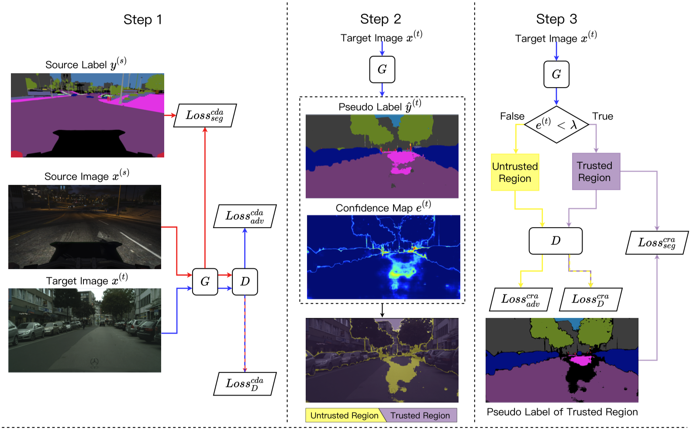

# Cross-Region Domain Adaptation for Class-level Alignment
This is a [pytorch](http://pytorch.org/) implementation of [CRA](https://arxiv.org/abs/2109.06422).


## Requirements
### Environment
```
conda create -n cra \
    python=3.6 tqdm yacs pillow \
    opencv matplotlib imageio \
    torchvision=0.8.2=py36_cu110 \
    pytorch=1.7.1=py3.6_cuda11.0.221_cudnn8.0.5_0 -c pytorch
conda activate cra
pip install mmcv
```
### Data Preparation
- Download [The GTA5 Dataset]( https://download.visinf.tu-darmstadt.de/data/from_games/ )

- Download [The SYNTHIA Dataset]( http://synthia-dataset.net/download/808/ )

- Download [The Cityscapes Dataset]( https://www.cityscapes-dataset.com/ )

- Symlink the required dataset
```bash
ln -s /path_to_gta5_dataset datasets/gta5
ln -s /path_to_synthia_dataset datasets/synthia
ln -s /path_to_cityscapes_dataset datasets/cityscapes
```

- Generate the label statics file for GTA5 and SYNTHIA Datasets by running 
```
python datasets/generate_gta5_label_info.py -d datasets/gta5 -o datasets/gta5/
python datasets/generate_synthia_label_info.py -d datasets/synthia -o datasets/synthia/
```

The data folder should be structured as follows:
```
├── datasets/
│   ├── cityscapes/     
|   |   ├── gtFine/
|   |   ├── leftImg8bit/
│   ├── gta5/
|   |   ├── images/
|   |   ├── labels/
|   |   ├── gtav_label_info.p
│   ├── synthia/
|   |   ├── RAND_CITYSCAPES/
|   |   ├── synthia_label_info.p
│   └── 			
...
```
## Pretrained Models
The pretrained models for GTA5 -> Cityscapes task (based on FADA) are available [here](https://github.com/zhijiew/CRA/releases). Please download and place them in ```<root_dir>/pretrained```.

## Evaluate
```
# evaluate CRA
python test.py -cfg configs/deeplabv2_r101_cra.yaml \
    resume pretrained/cra.pth

# evaluate CRA (w/ self distillation)
python test.py -cfg configs/deeplabv2_r101_tgt_self_distill.yaml \
    resume pretrained/cra_sd.pth
```

## Train
```
# train CRA
bash train.sh
```

## Citation
If you find this repository useful please consider citing
```
@article{cra,
  title={Cross-region domain adaptation for class-level alignment},
  author={Wang, Zhijie and Liu, Xing and Suganuma, Masanori and Okatani, Takayuki},
  journal={arXiv preprint arXiv:2109.06422},
  year={2021}
}
```

## Acknowledgement
This repository is heavily modified from [FADA](https://github.com/JDAI-CV/FADA) and [ADVENT](https://github.com/valeoai/ADVENT). 
